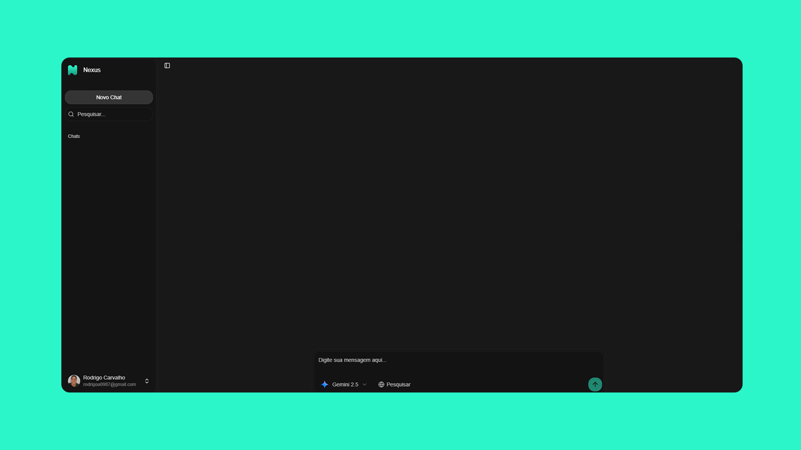

# N3xus



> **N3xus** - Uma plataforma de chat integrada com vários modelos de IA, onde o usuário pode alternar entre modelos, criar novos chats, organizar conversas e comparar respostas.

## Visão Geral

Nexus é uma aplicação SaaS completa construída com Next.js 15 que permite aos usuários interagir com os mais avançados modelos de IA através de uma interface moderna e intuitiva. A plataforma oferece autenticação robusta, sistema de assinaturas, controle de uso e uma experiência de chat em tempo real otimizada.

### Principais Funcionalidades

- **Múltiplos Modelos de IA**: Acesso a GPT-5, Gemini 2.5, Claude 4 Sonnet, e DeepSeek V3
- **Pesquisa Web Integrada**: Capacidade de buscar informações atualizadas na web durante conversas
- **Autenticação Completa**: Sistema de login com Google e email/senha usando Better Auth
- **Sistema de Assinaturas**: Integração com Stripe para planos Pro com limites personalizados
- **Controle de Uso**: Monitoramento detalhado de uso diário, semanal e mensal
- **Chat em Tempo Real**: Interface de streaming com suporte a markdown e syntax highlighting
- **Design Responsivo**: Interface otimizada para desktop e mobile
- **Tema Escuro/Claro**: Suporte completo a temas com next-themes
- **Compartilhamento**: Sistema de compartilhamento público de conversas
- **Histórico**: Navegação completa pelo histórico de conversas

## Arquitetura Técnica

### Stack Principal

- **Frontend**: Next.js 15 com App Router, React 19, TypeScript
- **Styling**: Tailwind CSS 4 com Radix UI components
- **Autenticação**: Better Auth com integração Stripe
- **Banco de Dados**: PostgreSQL com Prisma ORM
- **Pagamentos**: Stripe para assinaturas e billing
- **IA**: AISDK + OpenRouter para acesso unificado aos modelos
- **Deploy**: Otimizado para Vercel

### Estrutura do Projeto

```
nexus/
├── app/                          # App Router (Next.js 15)
│   ├── api/                      # API Routes
│   │   ├── auth/                 # Endpoints de autenticação
│   │   └── chat/                 # API de chat e streaming
│   ├── chat/                     # Páginas de chat
│   │   ├── [id]/                 # Chat específico por ID
│   │   └── page.tsx              # Lista de chats
│   ├── share/[id]/               # Compartilhamento público
│   └── generated/                # Prisma client gerado
├── components/                   # Componentes React
│   ├── ai-elements/              # Componentes específicos de IA
│   ├── chat/                     # Componentes de chat
│   ├── common/                   # Componentes compartilhados
│   └── sidebar/                  # Navegação lateral
├── lib/                          # Utilitários e configurações
│   ├── auth.ts                   # Configuração Better Auth
│   ├── prisma.ts                 # Cliente Prisma
│   └── openrouter.ts             # Configuração OpenRouter
├── prisma/                       # Schema e migrações
├── server/                       # Server actions
└── public/                       # Assets estáticos
```

## Configuração e Instalação

### Pré-requisitos

- Node.js 18+ 
- Contas configuradas: OpenRouter, AISDK, Stripe, Google OAuth

### Variáveis de Ambiente

Crie um arquivo `.env.local` com as seguintes variáveis:

```bash
# Database
DATABASE_URL="postgresql://..."

# Authentication
BETTER_AUTH_SECRET="your-secret-key"
GOOGLE_CLIENT_ID="your-google-client-id"
GOOGLE_CLIENT_SECRET="your-google-client-secret"

# AI Models
OPENROUTER_API_KEY="your-openrouter-key"

# Payments
STRIPE_SECRET_KEY="sk_..."
STRIPE_PUBLISHABLE_KEY="pk_..."
STRIPE_WEBHOOK_SECRET="whsec_..."

# Email (opcional)
RESEND_API_KEY="re_..."
```

### Instalação

```bash
# Clone o repositório
git clone <repository-url>
cd nexus

# Instale as dependências
npm install

# Configure o banco de dados
npx prisma generate
npx prisma migrate deploy

# Inicie o servidor de desenvolvimento
npm run dev
```

Acesse [http://localhost:3000](http://localhost:3000) para ver a aplicação.

## Scripts Disponíveis

```bash
npm run dev          # Servidor de desenvolvimento com Turbopack
npm run build        # Build de produção
npm run start        # Servidor de produção
npm run lint         # Linting com ESLint
```

## Modelo de Dados

### Principais Entidades

- **User**: Usuários com autenticação e perfis
- **Chat**: Conversas com títulos e metadados
- **Message**: Mensagens individuais com conteúdo JSON
- **Subscription**: Assinaturas Stripe com planos Pro
- **UserUsage**: Controle de limites de uso por período

### Limites de Uso (Plano Pro)

- **Diário**: 50 prompts
- **Semanal**: 250 prompts  
- **Mensal**: 1000 prompts

## Deploy

### Vercel (Recomendado)

1. Conecte o repositório ao Vercel
2. Configure as variáveis de ambiente
3. O deploy será automático a cada push

### Outras Plataformas

A aplicação é compatível com qualquer plataforma que suporte Next.js:

- Railway
- Render
- AWS Amplify
- Netlify (com adaptações)

## Segurança

- **Autenticação**: Better Auth com sessões seguras
- **Autorização**: Verificação de usuário em todas as rotas protegidas
- **Rate Limiting**: Controle de uso baseado em assinaturas
- **Validação**: Zod para validação de dados
- **CSRF Protection**: Proteção nativa do Next.js

## Performance

- **Server Components**: Renderização otimizada no servidor
- **Streaming**: Respostas de IA em tempo real
- **Caching**: Cache inteligente de rotas e dados
- **Code Splitting**: Carregamento sob demanda
- **Image Optimization**: Otimização automática de imagens


## Licença

Este projeto está sob a licença MIT. Veja o arquivo `LICENSE` para mais detalhes.