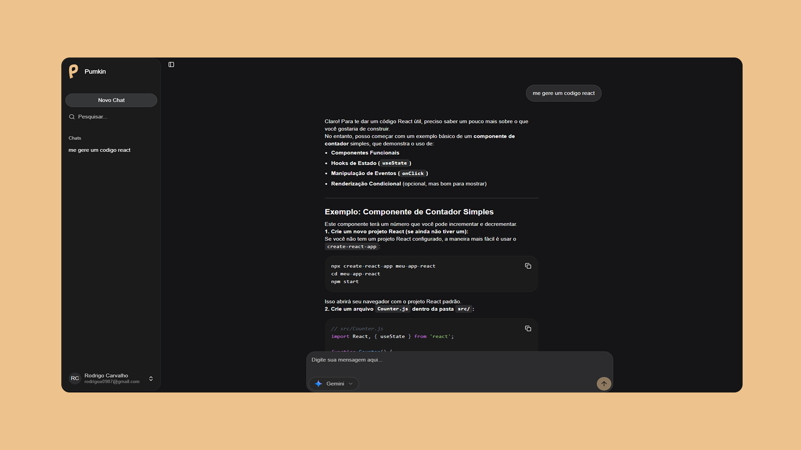

# Pumkin



> **Pumkin** - An integrated chat platform with multiple AI models, where users can switch between models, create new chats, organize conversations, and compare responses.

## Overview

Pumkin is a complete SaaS application built as a monorepo. The **web app** is built with **Next.js (App Router)** and talks to a dedicated **Hono API** backend. Authentication is handled with **Google OAuth** and **JWT**, with a **BFF layer** (Next.js Route Handlers) that stores the JWT in an **httpOnly cookie** and proxies authenticated requests to the API.

This repo contains 3 apps:

- **backend/**: Hono API + Prisma
- **web/**: Next.js app + BFF (`web/app/api/*`)
- **native/**: Expo app 

### Key Features

- **Multiple AI Models**: Access to GPT-5, Gemini 2.5, Claude 4 Sonnet, and DeepSeek V3
- **Integrated Web Search**: Ability to search for up-to-date information on the web during conversations
- **Authentication**: Google OAuth + JWT (httpOnly cookie) via Next.js BFF route handlers
- **Subscription System**: Stripe integration for Pro plans with custom limits
- **Usage Control**: Detailed monitoring of daily, weekly, and monthly usage
- **Real-Time Chat**: Streaming interface with markdown and syntax highlighting support
- **Responsive Design**: Interface optimized for desktop and mobile
- **Dark/Light Theme**: Full theme support with next-themes
- **Sharing**: Public conversation sharing system
- **History**: Complete navigation through conversation history

## Technical Architecture

### Main Stack

- **Frontend**: Next.js 16 with App Router, React 19, TypeScript
- **Styling**: Tailwind CSS 4 with Radix UI components
- **BFF Layer**: Next.js Route Handlers (`web/app/api/*`) proxying to the API
- **Backend**: Hono.js + Prisma (PostgreSQL)
- **Authentication**: Google OAuth (openid-client) + JWT
- **Database**: PostgreSQL with Prisma ORM
- **Payments**: Stripe for subscriptions and billing
- **AI**: AISDK + OpenRouter for unified model access
- **Deploy**: Optimized for Vercel (web) + any Bun host (API)

### Project Structure

```
pumkin/
├── backend/                      # Hono.js API (Prisma)
│   ├── api/                      # Entry point
│   ├── prisma/                   # Schema and migrations
│   └── src/
│       ├── routes/               # Hono routes (auth, chat, subscription, ...)
│       ├── services/             # Domain services (auth, chat, usage, ...)
│       └── repositories/         # Prisma repositories
├── web/                          # Next.js 16 app
│   ├── app/                      # App Router
│   │   └── api/                  # BFF Route Handlers (proxy to backend)
│   ├── components/               # UI
│   ├── data/                     # Client-side services (fetch to BFF)
│   └── server/                   # Server helpers/services used by app
└── native/                       # Mobile app
```

## Setup and Installation

### Prerequisites

- Bun (recommended)
- Node.js LTS (required by some Expo commands)
- PostgreSQL (for backend)
- Configured accounts: OpenRouter, Stripe, Google OAuth

### Quickstart (local)

1. **Backend env**
	- Copy `backend/.env.example` to `backend/.env`
	- Fill required variables (see below)
2. **Web env**
	- Create `web/.env.local` (see below)
3. **Install deps**
	- `backend/`: `bun install`
	- `web/`: `bun install`
	- `native/` (optional): `bun install`
4. **Database (backend/)**
	- `bun run db:generate`
	- `bun run db:migrate:prod`
5. **Run**
	- Terminal 1 (`backend/`): `bun run dev`
	- Terminal 2 (`web/`): `bun run dev`
	- Optional (`native/`): `bun run start`

### Environment Variables

This repo has **two** runtime apps (web + backend). Each one has its own environment file.

#### Backend (`backend/.env`)

Copy from `backend/.env.example` and fill:

```bash
# Server
NODE_ENV=development
PORT=3001
API_URL=http://localhost:3001
WEB_URL=http://localhost:3000

# Database
DATABASE_URL="postgresql://..."

# Auth
JWT_SECRET="your-secret-key"
GOOGLE_CLIENT_ID="your-google-client-id"
GOOGLE_CLIENT_SECRET="your-google-client-secret"

# AI
OPENROUTER_API_KEY="your-openrouter-key"

# Payments
STRIPE_SECRET_KEY="sk_..."
STRIPE_PUBLISHABLE_KEY="pk_..."
STRIPE_WEBHOOK_SECRET="whsec_..."
STRIPE_PRICE_PRO_MONTHLY="price_..."
STRIPE_PRICE_PRO_YEARLY="price_..."
```

Stripe webhook endpoint (configure in Stripe Dashboard):

`POST {API_URL}/api/webhooks/stripe`

#### Web (`web/.env.local`)

```bash
NEXT_PUBLIC_API_URL=http://localhost:3001
NEXT_PUBLIC_STRIPE_PUBLISHABLE_KEY="pk_..."
```

Notes:

- `NEXT_PUBLIC_API_URL` is used by the BFF helpers to call the backend.
- `NEXT_PUBLIC_STRIPE_PUBLISHABLE_KEY` is required for the upgrade checkout.

### Installation

```bash
# Install deps (each app has its own package.json)

cd backend && bun install
cd ../web && bun install
cd ../native && bun install
```

### Database

Run migrations from `backend/`:

```bash
cd backend
bun run db:generate
bun run db:migrate:prod
```

### Running locally

In one terminal:

```bash
cd backend
bun run dev
```

In another terminal:

```bash
cd web
bun run dev
```

Optional (mobile):

```bash
cd native
bun run start
```

Access:

- Web: [http://localhost:3000](http://localhost:3000)
- API: [http://localhost:3001](http://localhost:3001)

## Package managers and runtimes

### Current state

- Backend runtime: Bun
- Backend package manager: Bun (`bun.lockb`)
- Web package manager: Bun (`bun.lockb`)
- Native package manager: Bun (`bun.lockb`)

### Expo + EAS

- Expo and EAS support Bun as a package manager.
- EAS selects Bun when `bun.lockb` exists in `native/`.
- Keep Node.js LTS installed locally for some Expo commands.

If you want to pin a Bun version on EAS, configure it in `native/eas.json`.

References:

- `https://expo.dev/changelog/2023-09-25-eas-bun-support`
- `https://docs.expo.dev/guides/using-bun/`

## Available Scripts

```bash
# web/
bun run dev
bun run build
bun run start

# backend/
bun run dev
bun run build
bun run start
bun run db:generate
bun run db:migrate:prod

# native/
bun run start
bun run android
bun run ios
```

Each app has its own scripts under `backend/`, `web/`, and `native/`.

## Troubleshooting

### Windows: node_modules delete fails (Access denied)

If you get file lock errors removing `node_modules` (common with Next.js native binaries), stop any running dev servers, close any processes that might hold locks, then retry deletion.

### Expo + Bun prerequisites

Expo docs note that Node.js LTS is still required for some Bun-driven Expo commands because they use `npm pack` to download templates.

### Bun: blocked postinstall scripts

If Bun blocks a postinstall script during `bun install`, list untrusted packages and allow them if appropriate:

```bash
bun pm untrusted
```

### Stripe webhooks (local)

The backend expects Stripe webhooks at:

`POST {API_URL}/api/webhooks/stripe`

For local development, forward events to your machine using the Stripe CLI and
set `STRIPE_WEBHOOK_SECRET` accordingly.

## Data Model

### Main Entities

- **User**: Users with authentication and profiles
- **Chat**: Conversations with titles and metadata
- **Message**: Individual messages with JSON content
- **Subscription**: Stripe subscriptions with Pro plans
- **UserUsage**: Usage limit control by period

### Usage Limits (Pro Plan)

- **Daily**: 50 prompts
- **Weekly**: 250 prompts
- **Monthly**: 1000 prompts

## Deployment

### Vercel (Recommended)

1. Connect the repository to Vercel
2. Configure environment variables
3. Deployment will be automatic with each push

### Other Platforms

The application is compatible with any platform that supports Next.js:

- Railway
- Render
- AWS Amplify
- Netlify (with adaptations)

## Security

- **Authentication**: JWT stored in `httpOnly` cookie by Next.js BFF callback
- **Authorization**: API validates JWT on protected routes
- **Rate Limiting**: Subscription-based usage control
- **Validation**: Zod for data validation
- **CORS**: Allowlist origin configuration in the API

## Performance

- **Server Components**: Optimized server-side rendering
- **Streaming**: Real-time AI responses
- **Caching**: Intelligent route and data caching
- **Code Splitting**: On-demand loading
- **Image Optimization**: Automatic image optimization

## License

This project is licensed under the MIT License. See the LICENSE file for more details.

---
